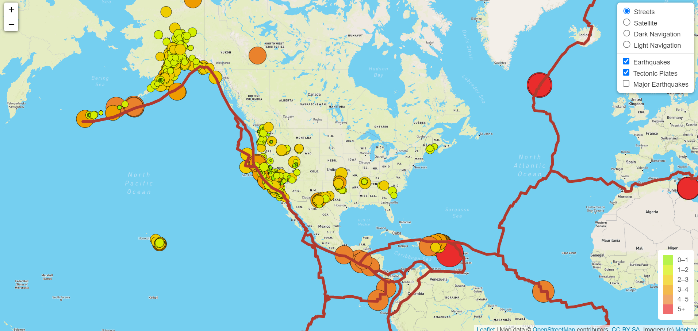

# Mapping_Earthquakes

## Project Overview

The objective of this project is to gather earthquake GeoJSON data from the USGS API, create and explore interactive maps of earthquakes around the world.
The earthquake data is represented on the maps in relation to the tectonic plates’ location on the earth, and according to each event's magnitude.

## Main Objectives

1. Create a branch from the main branch on GitHub.
2. Add, commit, and push data to a GitHub branch.
3. Merge a branch with the main branch on GitHub.
4. Retrieve data from a GeoJSON file.
5. Make API requests to a server to host geographical maps.
6. Populate geographical maps with GeoJSON data using JavaScript and the Data-Driven Documents (D3) library.
7. Add multiple map layers to geographical maps using Leaflet control plugins to add user interface controls.
8. Use JavaScript ES6 functions to add GeoJSON data, features, and interactivity to maps.
9. Render maps on a local server.

## Results

Each earthquake is visually represented by a circle and color, where a higher magnitude will have a larger diameter and will be darker in color. In addition, each earthquake has a popup marker that, when clicked, shows the magnitude of the earthquake and the location of the earthquake. The map has three views:

#### Street View

#### Satellite View

#### Dark View

#### Light View

